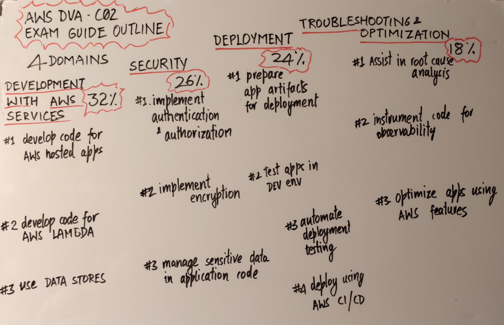

# Clean Whiteboard Images

A Python script that cleans whiteboard images by removing shadows, improving contrast, and achieving pure white backgrounds while preserving colored marker content.

## Features

- 🎨 **Color-preserving mode**: Maintains red, green, blue, and other colored markers
- ⚫ **Grayscale mode**: Clean black text on white background
- 🔄 **Batch processing**: Process entire directories with parallel processing
- 🎯 **Smart white balance**: Removes brownish/yellowish color casts for pure white backgrounds
- 🚀 **Multi-threaded**: Fast processing with configurable thread count
- 📁 **Flexible output**: Custom output directories and filename suffixes
- 🔍 **Comprehensive logging**: Detailed progress tracking and error reporting

Note - this does not handle image cropping and perspective or keystone correction.

## Before/After Examples

| Original | Cleaned |
|----------|---------|
|  |  |

## Installation

### Prerequisites

1. **Python 3.7+** - [Download Python](https://www.python.org/downloads/)
2. **ImageMagick** - [Installation guide](https://imagemagick.org/script/download.php)

#### Install ImageMagick:

**macOS (using Homebrew):**
```bash
brew install imagemagick
```

**Ubuntu/Debian:**
```bash
sudo apt-get install imagemagick
```

**Windows:**
- Download installer from [ImageMagick website](https://imagemagick.org/script/download.php#windows)
- Or use Chocolatey: `choco install imagemagick`

### Install whiteboard-clean

#### Option 1: Direct download
```bash
# Download the script
curl -O https://raw.githubusercontent.com/saraf/clean-whiteboard-images/main/whiteboard-clean

# Make it executable
chmod +x whiteboard-clean

# Optional: Add to PATH
sudo ln -s $(pwd)/whiteboard-clean /usr/local/bin/whiteboard-clean
```

#### Option 2: Clone repository
```bash
git clone https://github.com/saraf/clean-whiteboard-images.git
cd clean-whiteboard-images
chmod +x whiteboard-clean

# Optional: Add to PATH
sudo ln -s $(pwd)/whiteboard-clean /usr/local/bin/whiteboard-clean
```

## Usage

### Basic Examples

```bash
# Process current directory (preserves colors)
whiteboard-clean

# Process single image
whiteboard-clean photo.jpg

# Process directory recursively
whiteboard-clean -r ./whiteboard-photos

# Convert to grayscale
whiteboard-clean -g image.jpg

# Custom output directory and suffix
whiteboard-clean -o ./cleaned -s _enhanced photo.jpg

# Force overwrite existing files
whiteboard-clean -f -r ./photos

# Use more threads for faster processing
whiteboard-clean -j 8 -r ./large-folder
```

### Command Line Options

```
positional arguments:
  input_path            Input file or directory path (default: current directory)

optional arguments:
  -h, --help            show this help message and exit
  -o OUTPUT, --output OUTPUT
                        Output directory (default: same as input)
  -s SUFFIX, --suffix SUFFIX
                        Filename suffix (default: _cleaned)
  -r, --recursive       Process directories recursively
  -f, --force           Overwrite existing files
  -v, --verbose         Enable verbose output
  -j JOBS, --jobs JOBS  Number of parallel jobs (default: 4)
  -g, --grayscale       Force conversion to grayscale
```

### Supported Formats

- JPEG/JPG
- PNG
- TIFF/TIF
- BMP
- GIF

## How It Works

The script uses ImageMagick to apply a series of image processing operations:

### Color-Preserving Mode (Default)
1. **Auto-level**: Removes color casts and improves white balance
2. **White-point correction**: Achieves pure white backgrounds
3. **Color enhancement**: Boosts marker colors while maintaining natural tones
4. **Noise reduction**: Reduces camera noise while preserving text edges
5. **Contrast enhancement**: Improves readability with sigmoid curves
6. **Sharpening**: Enhances text clarity
7. **Final cleanup**: Ensures pure white background

### Grayscale Mode (`-g` flag)
1. **Colorspace conversion**: Converts to grayscale
2. **Auto-level**: Removes color casts
3. **Contrast enhancement**: Optimizes black text on white background
4. **Noise reduction**: Cleans up camera artifacts
5. **Sharpening**: Enhances text readability

## Performance

- **Single-threaded**: ~2-3 seconds per image
- **Multi-threaded**: Scales with CPU cores (use `-j` flag)
- **Memory usage**: Low (processes one image at a time per thread)
- **Recommended**: 4-8 threads for most systems

## Troubleshooting

### Common Issues

**"ImageMagick not found"**
- Install ImageMagick using your system's package manager
- Verify installation: `magick --version` or `convert --version`

**"Permission denied"**
- Make the script executable: `chmod +x whiteboard-clean`
- Check file permissions for input/output directories

**"Timeout processing"**
- Large images may take longer than 5 minutes
- Try reducing image size or increasing timeout in the code

**Poor results**
- Try grayscale mode (`-g`) for better contrast
- Ensure good lighting in original photos
- Avoid extreme shadows or reflections when photographing

### Tips for Best Results

1. **Good lighting**: Even, diffused lighting works best
2. **Perpendicular angle**: Photograph straight-on to avoid distortion
3. **High resolution**: Higher resolution input = better text clarity
4. **Stable camera**: Avoid blur from camera shake
5. **Clean whiteboard**: Remove old marker residue before photographing

## Contributing

Contributions are welcome! Please feel free to submit a Pull Request.

### Development Setup

```bash
git clone https://github.com/saraf/clean-whiteboard-images.git
cd clean-whiteboard-images

# Test the script
python whiteboard-clean --help
```

### Reporting Issues

Please include:
- Your operating system
- Python version (`python --version`)
- ImageMagick version (`magick --version`)
- Sample image (if possible)
- Full error message

## License

This project is licensed under the MIT License - see the [LICENSE](LICENSE) file for details.

## Acknowledgments

- Built with [ImageMagick](https://imagemagick.org/) - powerful image processing library
- Inspired by the need for clean, professional whiteboard digitization

## Changelog

### v1.0.0
- Initial release
- Color-preserving and grayscale modes
- Batch processing with multi-threading
- Pure white background correction
- Comprehensive error handling and logging

---

⭐ **Star this repository if you found it helpful!**
